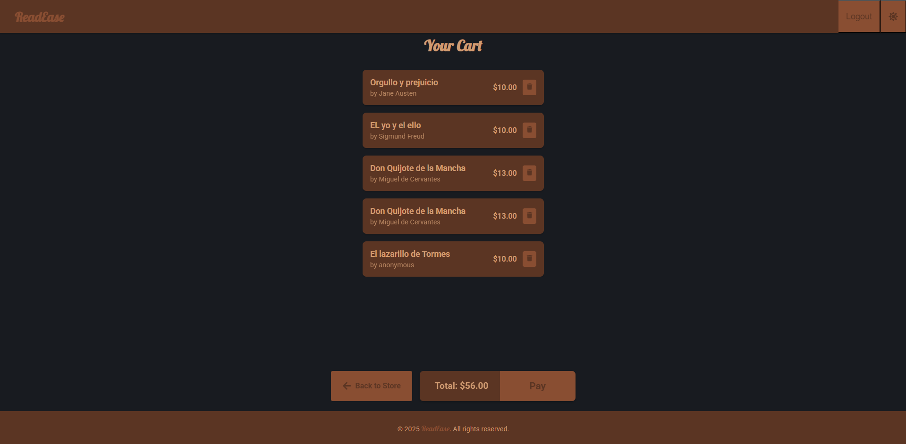

````markdown
# ReadEase

## Screenshots

### Light Mode

  
  

### Dark Mode

  
  

ReadEase is an application designed to facilitate reading and managing digital content, providing an intuitive and efficient user experience. The project is divided into two main parts: frontend and backend.

---

## Table of Contents

* [Technologies](#technologies)  
* [Installation](#installation)  
* [Database Setup](#database-setup)  
* [Admin Panel](#admin-panel)  
* [Project Structure](#project-structure)  
* [Testing](#testing)  
* [Next Steps](#next-steps)  
* [License](#license)  
* [Contact](#contact)  

---

## Technologies

* **Frontend:** React, Vite, Tailwind CSS  
* **Backend:** Node.js, Express, Sequelize  
* **Database:** MySQL  
* **Auth:** JWT (jsonwebtoken, bcryptjs)  
* **Admin Panel:** AdminJS  
* **Storage:** Multer, Cloudinary  
* **Testing:** Vitest (frontend), Jest (backend)  
* **Linting:** ESLint  

---

## Installation

### Prerequisites

* Node.js  
* MySQL  

### Steps

1. Clone the repo:

   ```bash
   git clone https://github.com/JaviAriza/ReadEase.git
````

2. Run frontend:

   ```bash
   cd ReadEase/ReadEase-Front
   npm install
   ./frontend.sh
   ```
3. Run backend:

   ```bash
   cd ../ReadEase-Back
   npm install
   ./backend.sh
   ```
4. Open browser at `http://localhost:3000/`

---

## Database Setup

1. Create database:

   ```sql
   CREATE DATABASE readease;
   ```
2. In `ReadEase-Back/.env` set:

   ```
   DB_HOST=localhost
   DB_USER=your_user
   DB_PASSWORD=your_pass
   DB_NAME=readease
   DB_PORT=3306
   ```
3. Run migrations/SQL scripts if any.

---

## Admin Panel

After starting the backend you’ll see:

```
✔️ Database connected  
🚀 Server at http://localhost:3000/  
🛠 AdminJS at http://localhost:3000/admin
```

Go to **[http://localhost:3000/admin](http://localhost:3000/admin)** and log in with your admin credentials.

---

## Project Structure

```
ReadEase/
├─ ReadEase-Back/        # Backend  
│  ├─ scripts backend.sh  
│  └─ …  
├─ ReadEase-Front/       # Frontend  
│  ├─ scripts frontend.sh  
│  └─ …  
└─ README.md  
```

---

## Testing

### Frontend

```bash
cd ReadEase-Front
npm install
npm run coverage
```


### Backend

```bash
cd ReadEase-Back
npm install
npm run coverage
```


---

## Next Steps

* Read mode
* Verify purchases
* Admin panel design
* Purchase history

---

## License

This project is licensed under the MIT License. See [LICENSE](LICENSE) for details.

---

## Contact

Email: [javier.ariza.rosales@gmail.com](mailto:javier.ariza.rosales@gmail.com)

```
```
